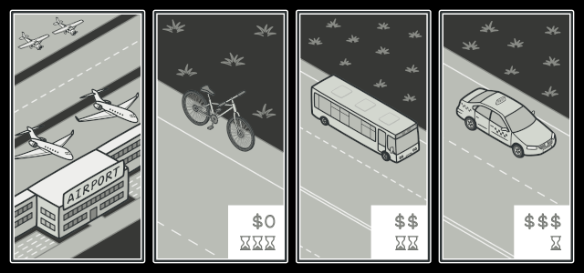

#Strategy Pattern

##Key notes:

1. Strategy is behavioral design pattern. It is used to switch between family of algorithms.
2. This pattern contains one abstract strategy interface and many concrete strategy implementations (algorithms) of that interface.
3. The application uses strategy interface only. Depending on some configuration parameter, the concrete strategy will be tagged to interface.

---

- The Strategy pattern lets you indirectly alter the object’s behavior at runtime by associating it with different sub-objects which can perform specific sub-tasks in different ways.
- The Strategy pattern lets you extract the varying behavior into a separate class hierarchy and combine the original classes into one, thereby reducing duplicate code.
- The Strategy pattern lets you isolate the code, internal data, and dependencies of various algorithms from the rest of the code. Various clients get a simple interface to execute the algorithms and switch them at runtime.
- The Strategy pattern lets you do away with such a conditional by extracting all algorithms into separate classes, all of which implement the same interface. The original object delegates execution to one of these objects, instead of implementing all variants of the algorithm.

---

- Use the Strategy pattern when you want to use different variants of an algorithm within an object and be able to switch from one algorithm to another during runtime.
- Use the Strategy when you have a lot of similar classes that only differ in the way they execute some behavior.
- Use the pattern to isolate the business logic of a class from the implementation details of algorithms that may not be as important in the context of that logic.
- Use the pattern when your class has a massive conditional operator that switches between different variants of the same algorithm.

UML Diagram from wikipedia

enter image description here

One real word example : Airlines offering discounts during some months (July-December). You can have one Fare module, which decides pricing options depending on month number.